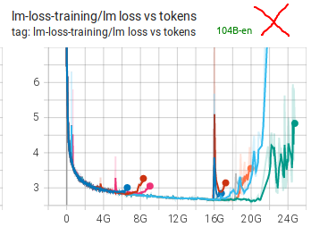
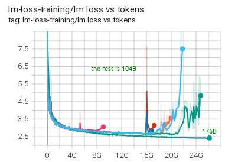

# The final training

Trials and tribulations during the 176B 250k multi-lingual training.

For the trials and tribulation during the preparation stage before the launch  see: [chronicles-prequel](chronicles-prequel.md).

The full spec is [here](README.md) and the script is [here](tr11-176B-ml.slurm).

## main


### 2022-03-11

Launch

The training launched on March 11, 2022 11:42am PST


### 2022-03-14

Switched from MBS=1 to MBS=2 at GBS=784, as now there is enough microbatches in each of the 8 replicas to fill each pipeline 4 times. With MBS=2 each replica has `784/(2*8) = 49` microbatches over 12 PP stages which is already pretty efficient. (`GBS/(MBS*DP)`)


### 2022-03-18

7 days after the launch the training finished the batch size ramp up stage and we are now at full throttle of GBS=2048 and at 149-150 TFLOPs.

A single train iteration is about 105 secs.

A single eval iteration is about 12 min (1 iteration eval on each of 29 datasets) - we perform it once every 1k iteration and it "costs" about 7 iterations or 0.7% of training.

A checkpoint is saved in 40 secs, which is about 1/2 iteration duration.

We consumed 20B/450B tokens.

At the current speed and no downtime we need 125 days more `(115311-12695)*105/(3600*24)=124.7` to finish the plan.

the math is based on the recent log:

```
 [default7]: iteration    12695/  115311 | consumed samples:      9841584 | consumed tokens:  20155564032 | elapsed time per iteration (s): 105.22 | learning rate: 5.969E-05 | global batch size:  2048 | lm loss: 2.463556E+00 | grad norm: 0.174 | num zeros: 0.0 | number of skipped iterations:   0 | number of nan iterations:   0 | samples per second: 19.463 | TFLOPs: 149.02 |
```


### What makes the 176B-ml training so stable?

To compare: at [104B-en experiments](https://huggingface.co/bigscience/tr8b-104B-logs/tensorboard#scalars&runSelectionState=eyJ0ZW5zb3Jib2FyZC9iYXNlLWV4cC0xMSI6dHJ1ZSwidGVuc29yYm9hcmQvY2wtZXhwLTAxIjpmYWxzZSwidGVuc29yYm9hcmQvY2wtZXhwLTAyIjpmYWxzZSwidGVuc29yYm9hcmQvYm5iLWV4cC0wMSI6ZmFsc2UsInRlbnNvcmJvYXJkL2JuYi1leHAtMDIiOmZhbHNlLCJ0ZW5zb3Jib2FyZC9ibmItZXhwLTAzIjpmYWxzZSwidGVuc29yYm9hcmQvYm5iLWV4cC0wNCI6ZmFsc2UsInRlbnNvcmJvYXJkL2Jhc2UtZXhwLTEyIjp0cnVlLCJ0ZW5zb3Jib2FyZC9ibmIiOnRydWUsInRlbnNvcmJvYXJkL2JuYi1leHAtMDUiOnRydWUsInRlbnNvcmJvYXJkL2VtYi1ub3JtIjp0cnVlLCJ0ZW5zb3Jib2FyZC9lbWItbm9ybS0wMSI6dHJ1ZSwidGVuc29yYm9hcmQvZW1iLW5vcm0tMDIiOnRydWUsInRlbnNvcmJvYXJkL2VtYi1ub3JtLTAzIjp0cnVlLCJ0ZW5zb3Jib2FyZC9lbWItbm9ybS0wNCI6dHJ1ZSwidGVuc29yYm9hcmQvZW1iLW5vcm0tMDUiOnRydWUsInRlbnNvcmJvYXJkL2VtYi1ub3JtLTA2Ijp0cnVlLCJ0ZW5zb3Jib2FyZC9jbCI6ZmFsc2UsInRlbnNvcmJvYXJkL2NsLWExMDAiOmZhbHNlfQ%3D%3D&tagFilter=loss%20vs%20tokens) we failed to cross the 24B-tokens barrier. You can find the indepth details in [the 104B chronicles](../tr8b-104B/chronicles.md).



At 176B-ml we have crossed [24B-tokens barrier](https://huggingface.co/bigscience/tr11-176B-ml-logs/tensorboard#scalars&tagFilter=loss%20vs%20tokens&_smoothingWeight=0) w/o a single instability issue:


Here is an overlapping image:



It's hard to tell if there is one specific improvement that made the biggest impact w/o doing ablation studies, which would be both expensive and time consuming.

It's probably a combination of a few or all of the following improvements:

1. Very clean data
2. BF16 mixed precision regime
3. FP32 grad accumulation for the pipeline
4. A very low standard initialization `sqrt(0.3333/NHIDDEN)` - in 104B-en used `sqrt(0.4/NHIDDEN)`
5. Word embedding layer norm - but it was also used in 104B-en

If you believe in metaphysics perhaps one more important factor is the "intentional" contribution of many thousands of ML enthusiasts around the world who want this largest open source multilingual language model training to succeed.


### 2022-03-21

One of the GPUs crashed at 2022-03-21_13:34:34 JZ time:

```
[default3]:terminate called after throwing an instance of 'c10::CUDAError'
[default3]:  what():  CUDA error: unknown error
[default3]:Exception raised from query at ../aten/src/ATen/cuda/CUDAEvent.h:95 (most recent call first):
[default3]:frame #0: c10::Error::Error(c10::SourceLocation, std::string) + 0x42 (0x1518a06137d2 in /gpfswork/rech/six/commun/conda/tr11-176B-ml/lib/python3.8/site-packages/torch/lib/libc10.so)
[default3]:frame #1: c10d::ProcessGroupNCCL::WorkNCCL::finishedGPUExecutionInternal() const + 0x11a (0x15190c6c29ea in /gpfswork/rech/six/commun/conda/tr11-176B-ml/lib/python3.8/site-packages/torch/lib/libtorch_cuda_cpp.so)
[default3]:frame #2: c10d::ProcessGroupNCCL::WorkNCCL::isCompleted() + 0x50 (0x15190c6c4fd0 in /gpfswork/rech/six/commun/conda/tr11-176B-ml/lib/python3.8/site-packages/torch/lib/libtorch_cuda_cpp.so)
[default3]:frame #3: c10d::ProcessGroupNCCL::workCleanupLoop() + 0x145 (0x15190c6c6265 in /gpfswork/rech/six/commun/conda/tr11-176B-ml/lib/python3.8/site-packages/torch/lib/libtorch_cuda_cpp.so)
[default3]:frame #4: <unknown function> + 0xc2ba3 (0x15191b339ba3 in /lib64/libstdc++.so.6)
[default3]:frame #5: <unknown function> + 0x814a (0x15191c77d14a in /lib64/libpthread.so.0)
[default3]:frame #6: clone + 0x43 (0x15191c4acdc3 in /lib64/libc.so.6)
```

we lost 7.3h of work, it failed 2 iterations before checkpoint saving time :(

Will switch to more frequent checkpoint saving of 200 iterations and will lower it further if the hardware failures continue. With 2.3TB checkpoint size and 40 secs to save a checkpoint we don't want to do it too often.
