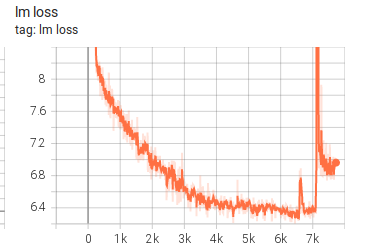
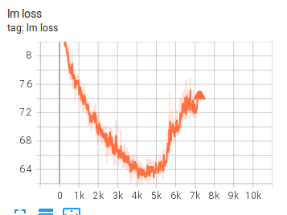
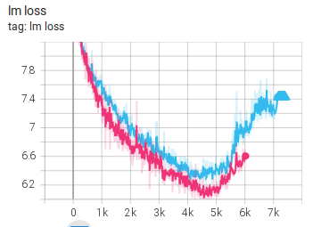
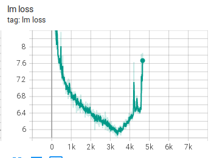
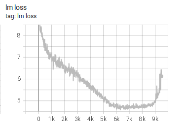
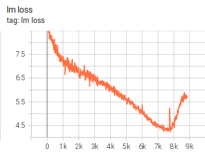
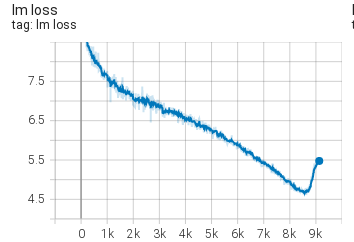
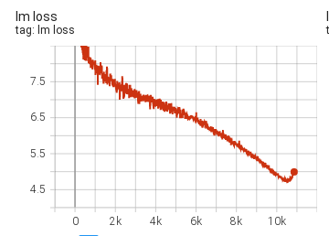
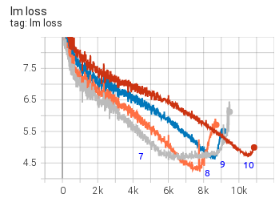
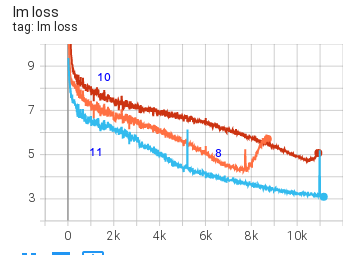

# tr8-104B Chronicles

Notes on the training progress with a particular focus on any encountered problems and their diagnosis and solutions/prevention.

The timeline is from the top-down, more recent events are documented last.

To follow the training progress charts, see:  [tensorboard](https://huggingface.co/bigscience/tr8-104B-logs/tensorboard)

To follow the raw training logs see: [logs](https://huggingface.co/bigscience/tr8-104B-logs/tree/main/logs)

The currently used SLURM script is at [tr8-104B.slurm](tr8-104B.slurm).

## Experiment 1

- Nodes: `64`
- Seed: `42`
- Started from iteration 0


Somewhere between iteration 7000 and 7010 lm loss jumped from 6.4 to 14 and then 200 iterations later it went down to ~7 and stayed there w/o any change, and later it went into NaN.

```
 iteration     7000/  159576 | consumed samples:       260912 | elapsed time per iteration (ms): 18706.1 | learning rate: 6.000E-05 | global batch size:    96 | lm loss: 6.444662E+00 | loss scale: 2048.0 | grad norm: 98258.265 | num zeros: 0.0 | number of skipped iterations:   0 | number of nan iterations:   0 |
------------------------------------------------------------------------------------------------
 validation loss at iteration 7000 | lm loss value: 7.174200E+00 | lm loss PPL: 1.305315E+03 |
------------------------------------------------------------------------------------------------
 iteration     7010/  159576 | consumed samples:       261872 | elapsed time per iteration (ms): 19904.0 | learning rate: 6.000E-05 | global batch size:    96 | lm loss: 1.142026E+01 | loss scale: 2048.0 | grad norm: 219645.978 | num zeros: 0.0 | number of skipped iterations:   0 | number of nan iterations:   0 |
 [...]
 iteration     7220/  159576 | consumed samples:       282032 | elapsed time per iteration (ms): 18333.4 | learning rate: 6.000E-05 | global batch size:    96 | lm loss: 7.155109E+00 | loss scale: 2048.0 | grad norm: 16921.991 | num zeros: 0.0 | number of skipped iterations:   0 | number of nan iterations:   0 |

```


Training more hasn't helped at all.

Solution:
- roll back to the last good checkpoint `global_step6210`
- change seed. New seed `43`.

Rollback:
1. checkpoints:
```
cd /gpfsscratch/rech/six/commun/checkpoints/tr8-104B/checkpoints
```

moved all checkpoints after `global_step6210` to another dir

fixed the `latest*` files to point to the checkpoint of our choice:

```
cat latest
perl -pi -e 's|\d+|6210|' latest*
```
check it's correct:
```
cat latest
cat latest_checkpointed_iteration.txt
```


2. couldn't leave tensorboard files from the unrolled section as is, so fixed tensorboard by first copying all the existing events log files to a new dir
```
cd /gpfsscratch/rech/six/commun/checkpoints/tr8-104B/tr8-104B-logs/tensorboard
mkdir tb-7k-glitch
cp events* tb-7k-glitch
git add tb-7k-glitch
git commit -m "saved the original tensorboard logs" tb-7k-glitch
git push
```
now checking the timestamp of the last checkpoint `global_step6210` we are rolling from and now manually removing all event log files from the main log whose timestamp is newer than the checkpoint `global_step6210`

now we have 2 tensorboards - the main running one and the one which we couldn't recover from - but we want it for posterity

Having a new seed forced regeneration of `.pny` files which re-randomized the order. If the glitch were due to faulty data this should have fixed the problem.

Started a new training from the last good checkpoint and it run until we run into a similar glitch even sooner.

## Experiment 2


- Nodes: `64`
- Seed: `43` (from the beginning)
- Restarted from `global_step6210`


Similar to glitch 1, but even sooner we went from 6.3 to 9 to 6.7


```
 iteration     6900/  159576 | consumed samples:       251312 | elapsed time per iteration (ms): 18495.6 | learning rate: 6.000E-05 | global batch size:    96 | lm loss: 6.365808E+00 | loss scale: 4096.0 | grad norm: 95313.572 | num zeros: 0.0 | number of skipped iterations:   0 | number of nan iterations:   0 |
 iteration     6910/  159576 | consumed samples:       252272 | elapsed time per iteration (ms): 18802.1 | learning rate: 6.000E-05 | global batch size:    96 | lm loss: 6.598378E+00 | loss scale: 4096.0 | grad norm: 84678.880 | num zeros: 0.0 | number of skipped iterations:   0 | number of nan iterations:   0 |
 iteration     6920/  159576 | consumed samples:       253232 | elapsed time per iteration (ms): 18641.0 | learning rate: 6.000E-05 | global batch size:    96 | lm loss: 7.314456E+00 | loss scale: 4096.0 | grad norm: 122716.232 | num zeros: 0.0 | number of skipped iterations:   0 | number of nan iterations:   0 |
 iteration     6930/  159576 | consumed samples:       254192 | elapsed time per iteration (ms): 18564.1 | learning rate: 6.000E-05 | global batch size:    96 | lm loss: 9.121927E+00 | loss scale: 4096.0 | grad norm: 283384.130 | num zeros: 0.0 | number of skipped iterations:   0 | number of nan iterations:   0 |
 iteration     6940/  159576 | consumed samples:       255152 | elapsed time per iteration (ms): 18549.7 | learning rate: 6.000E-05 | global batch size:    96 | lm loss: 1.023865E+01 | loss scale: 4096.0 | grad norm: 42359.376 | num zeros: 0.0 | number of skipped iterations:   0 | number of nan iterations:   0 |
```

Conglong Li made an interesting observation that in both cases the glitch happened very closely to the moment where LR warmup stopped, to quote:

> The gradients are the largest at the end of the LR ramp-up phase, so that's when there the training is the most unstable. There is no easy fix. Curriculum learning helps, and so does potentially lengthening warm-up/reducing the LR.
>
> We logged the L1 norm/max element of Adam optimizer's gradient variance, and found that 1) the norm and max element has a correlation with the LR schedule: they all reach max at/near LR peak 2) that is also where we have the highest risk of divergence.

Moreover, we reviewed the tr1-13B training and we had a huge glitch there from which it recovered, perhaps since the model was much smaller.


There the LR rampup stopped around 25k, and the first huge glitch occurred at around 29k iteration
https://huggingface.co/bigscience/tr1-13B-tensorboard/tensorboard
According to Conglong Li 25k and 29k are close enough based on their study. Quoting Conglong:

> In our study of [1.5B gpt-2](https://arxiv.org/pdf/2108.06084.pdf), we used 3K LR warmup and here you can see the grad variance norm (left) only reach bottom at 8K+ steps, and baseline's grad var max is unstable during first 10K+ steps:


So it looks that now we have 3 documented glitches that all are related to the end of the LR warm up end.

We are not yet excluding the case that something is wrong with the data. Going to look into it next.

After some more iterations this training went belly up in the same way via a second smaller glitch followed by loss going to NaN. Same as the first one just at a slightly different iteration.

Stopped this training.

So rolling back tensorboard and checkpoints again as described in the previous section

Also until we figure out the stability going to switch to a much more frequent checkpoint saving so it's much faster continue from the last good iteration. Let's try 300.
```
SAVE_INTERVAL=300
```


## Experiment 3

Corby Rosset suggested we try a more numerically stable self-attention version, which was implemented [here](https://github.com/bigscience-workshop/Megatron-DeepSpeed/pull/118)

Quoting:

Re: 104B instability (https://huggingface.slack.com/archives/C01NHER1JLS/p1632801340055000) One thing I've encountered before is how the self-attention is computed. E.g. this [line](https://github.com/bigscience-workshop/Megatron-DeepSpeed/blob/c839a8aa30731f71b3738d56009be9668508e366/megatron/model/transformer.py#L303) shows that the norm_factor may be multiplied after the Query * Key matrix multiplication. If the dim of Q and K are very large, the output may blow up and the norm_factor won't be able to save it.

Proposal: move the norm_factor inward, so Q and K are scaled down before matrix multiply:
```
matmul_result = torch.baddbmm(
            matmul_result,
            1.0/math.sqrt(self.norm_factor) * query_layer.transpose(0, 1),   # [b * np, sq, hn]
            1.0/math.sqrt(self.norm_factor) * key_layer.transpose(0, 1).transpose(1, 2),  # [b * np, hn, sk]
            beta=0.0 if alibi is None else 1.0, alpha=1.0)

        # change view to [b, np, sq, sk]
        attention_scores = matmul_result.view(*output_size)
```

To make the operation mathematically equivalent, moving the norm factor inward requires taking sqrt again
if n is a scalar, A and B matrices:
```
n * (A dot B) === (sqrt(n) * A) dot (sqrt(n) * B)
```

Also thanks to @RezaYazdaniAminabadi who helped to find where this function is defined in CuBlas https://docs.nvidia.com/cuda/cublas/index.html#cublas-GemmStridedBatchedEx and which includes the definition:

```
C+i*strideC=αop(A+i*strideA)op(B+i*strideB)+β(C+i*strideC), for i ∈[0,batchCount−1]
```
the issue is alpha is multiplied after the matrix-matrix mul is done so it can cause instability

- Repeated the same rollback to iteration 6210
- kept seed 43 (so the same data as experiment 2)

Also codecarbon has been ignoring the `log_level="error"` setting and bombarding the main log with thousands of warnings, which also indicate that it misses a lot of measurements, so turning it off as the measurements will be wrong anyway.

Experiment 3 failed in a very similar way as experiment 2




## Experiment 4

Iz Beltagy compiled a list of suggestions to try next. Quoting Iz:

A few thoughts and suggestions

The previous conversations are discussing two hypotheses for spikes and divergence.

* bad data: one easy way to test this hypothesis is to shuffle the data. Given that we tried this and it didn’t change much, I am less inclined to believe it is data. I also like to believe that these models are more robust to bad data than we are giving them credit. Maybe the model won’t learn anything useful, but at least it shouldn’t diverge
* it is fp16: this is possible and an easy way to test this hypothesis is to run everything on fp32. If it works, then we know it is fp16, so we go back and try to find the part of the network that is upsetting fp16 whether it is softmax, faulty implementation of selfattention, loss scale .. etc. But if we use fp32 and the model still diverges, then we don’t need to spend time exploring these tricks because we know they are not going to fix the problem

Let me add a few more hypotheses to the mix

* We are using beta2=0.999, while gpt3 used 0.95. My understanding is 0.95 is more stable but slower to train. I would try this as well given how easily and quickly the model is diverging

* Bad model design: prior work showed that the ratio between width and depth is important. That certainly matters for the loss but I don’t know how much it matters for the model stability. However, it is worth noting that this model is much much worse than the 13B model. After 6K steps it reaches loss=6.3 and the loss slowed down while the 13B model reached loss=4.5 and the loss is still sharply decreasing. This could be related; the model is not learning anything useful and thus easily diverging.

* Regarding the restarts, looking at the loss-scale curve, looks like the model was heading toward divergence long before 6Ksteps, maybe around 4.7Ksteps. If you restart, I would suggest going back to a checkpoint before 4.7K steps.

* Curriculum learning: it is a great idea, we tried it in a different project (but smaller models) and it works, but the model should train reasonably well without it. Using it now might mask a bigger underlying problem that we need to fix first

So to summarize, here are things to try
* if you still feel data could be the reason, try shuffling again but restart from step before 4.7K
* if it doesn’t work, disable fp16 and run everything in fp32 restarting from before step 4.7K
* if it doesn’t work, rerun from scratch with beta2=0.95 (I don’t have a good intuition if the model can recover with changing beta2 mid training, it might, I don’t know)
* if it doesn’t work, change model design to one with a reasonable ratio between depth/width

Samyam Rajbhandari seconded Iz's proposal:

I second @Iz Beltagy’s suggestion to use beta2=0.95. We have seen it stabilize very similar spiky loss in several cases.    My feeling is that it might be ok even without a full restart. But restarting early would be helpful. Depending on how long it takes, I feel like 6K, 4K and 3K would be good candidates to restart in an increasing order of preference.

So stopped the last experiment and started a new one - identical to Experiment 3, but:

- rolled back to iteration 3k - so earlier than 6210, as suggested that it might be too close to the blow up and we should try to make things better before that
- `--adam-beta2 0.95` - it should make the training slower but more stable


Rollback performed:

1. checkpoints:
```
cd /gpfsscratch/rech/six/commun/checkpoints/tr8-104B/checkpoints
```

moved all checkpoints after `global_step3000` to another dir

fixed the `latest*` files to point to the checkpoint of our choice:

```
cat latest
perl -pi -e 's|\d+|3000|' latest*
```
check it's correct:
```
cat latest
cat latest_checkpointed_iteration.txt
```

2. tensorboard, similar to the previous tries.




It went in the wrong direction around iteration 5k - stopped this experiment.


## Experiment 5

Same as Experiment 4, but rolling back to iteration 0.




It trained faster but still went in the wrong direction around iteration 5k - stopped this experiment.


## Experiment 6

Discovered a really bad mistake in the setup that impacted all the previous experiments that failed.
 When changing from 13B to 104B I did not update `FFN_HIDDEN_SIZE` and it remained `20480` when it should have become `65536`, so it has been a very lopsided 58B model instead of 104B all along.

Lesson learned: I'm going to change the slurm script to not explicitly set `FFN_HIDDEN_SIZE` and let Megatron automatically set `FFN_HIDDEN_SIZE = 4 * HIDDEN_SIZE` to avoid similar errors in the future.

Additionally, because `FFN_HIDDEN_SIZE` was so small, the fixed setup required re-tune up of the training setup - as a lot more nodes are now required.

So let's look at the math:

```
## Let h = hidden size, n = num_layers, k = num_heads, s = sequence length, v = vocabulary size
total_params = n * (12h^2 + 13h) + (v * h) + (s * h) + 2*h
```

the correct 104B is:
- 0.8x times layers=32 than 13B (40)
- 3.2x times NHIDDEN=16384 than 13B (5120)

While the 104B model is 8x times bigger than 13B param-wise, the model grows quadratically with NHIDDEN size, so each layer will require ~10x (3.2**2) more gpu memory plus more memory per activations. We double TP from 2 to 4 as 4 is a max we can use on a 4-gpu node. So we have to 5x the PP then, so we need at least PP=20, and to work with NLAYERS=32, it takes us to PP=32.

So the needed config is:
```
TP_SIZE=4
PP_SIZE=32
```

so 13B took 8 gpus for a single replica, and 104B needs 128 gpus (16x times more)

I also switcheed to `--rampup-batch-size 32 32 6_000_000`, because of PP=32 (but that wasn't needed since it's the number of replicas that matters. there needs to be enough batch size to go over replicas, so `BS>n_replicas` and `BS` has to be divisible by `n_replicas`. Corrected this in the following experiment.)

I'm going to repeat Experiment 5 with :

- fixed `FFN_HIDDEN_SIZE` (so that it's `4 * HIDDEN_SIZE`)
-  `--rampup-batch-size 32 32 6_000_000`

And the outcome is very similar to Exp 4 and 5 despite the corrected model shape:




## Future Experiments

1. if it doesn’t work, change model design to one with a reasonable ratio between depth/width - currently it's 512. Try 256? (going for the opposite of very deep and shallow won't be learning much)

2. get back to beta2=0.999 (with spikes) and try fp32. If Corby’s self-attn version made a difference, then maybe it is an fp16 instability issue.
   note: This will require approximately 30% more RAM for activation memory - so to run this experiment we have to first test that we can fit it.
```
perl -pi -e 's|--adam-beta2 0.95|--adam-beta2 0.95|' *slurm
```

3. try lower learning rate (half the LR and longer warmup) - ideally wait for CongLong
   - try lower target learning rate 2.5e-5 - longer ramp up - past 10k iterations (Samyam)
   - max lr the same - twice as long ramp up, half as long, (Stella)
   - Curriculum Learning should fix all these lr-related problem (waiting for CL implementation)

4. reduce SEQLEN 1024K? 512?

5. Switch to LAMB? But we haven't discussed that in details.


## Experiment 7

Same as Exp 6 with the following changes:

1. Trying width/depth ration of 180 instead of 512. Which puts it into a normal range and it's no longer an unusually wide model (in the megatron's paper the ratio grows from 150 to 200 as the model grows). Also raising heads to 80 to again be in the ballpark of normal ratio.

```
NLAYERS=64
NHIDDEN=11600
NHEADS=80
```


```
perl -pi -e 's|NHIDDEN=16384|NHIDDEN=11600|' *slurm
perl -pi -e 's|NLAYERS=32|NLAYERS=64|' *slurm
perl -pi -e 's|NHEADS=32|NHEADS=80|' *slurm
```

Note: this should use less gpu memory too, but if it's another short experiment there is no need to re-tune the training setup.

We don't know whether it was a good idea to change `NHEADS` - it doesn't change the model size, and there is [research](https://blog.ml.cmu.edu/2020/03/20/are-sixteen-heads-really-better-than-one/) that shows that nheads doesn't quite matter. We could have kept `NHEADS=32` and used `NHIDDEN=11616` to keep the model of the same size (tiny change). The two have to respect`NHIDDEN % NHEADS = 0` rule.

2. reverted back to `--rampup-batch-size 16 16 6_000_000`. We were fine with BS increments of 16 since we can't fit too many replicas anyway. Since currently each replica is 32 nodes, with 64 or 128 nodes we will be using only 2 or 4 replicas, therefore no problem to run BS=16 increments.

This one failed too:



## Experiment 8

Half lr, and 1/3 longer warm up:

```
    --lr 3e-5 \
    --lr-warmup-samples 300_000 \
```

The failure is very similar to Exp 7




## Experiment 9


Trying much longer warmup:

```
    --lr 3e-5 \
    --lr-warmup-samples 1_000_000 \
```

Very similar failure to Exp 8




## Experiment 10

```
perl -pi -e 's|--lr 3e-5|--lr 1e-5|' *slurm
```

Same as Exp 9 but with `lr=1e-5`,

Initially the plan was to restart Exp 9 from step 6900, but Meg didn't accept the change and crashed with:
```
AnnealingLR: class input value 1e-05 and checkpointvalue 3e-05 for learning rate do not match
```

So had to start from scratch.

This will be the last experiment that plays with a different max LR value.

The outcome is very similar to the previous 3 experiments around LR modifications.




## Experiments 7-10 Summary


Here is the summary of the 4 experiments (7-10) around LR tweaks:

| Exp |   lr | lr-warmup |
| --: | ---: | --------: |
|   7 | 6e-5 | 0.26M     |
|   8 | 3e-5 | 0.3M      |
|   9 | 3e-5 | 1M        |
|  10 | 1e-5 | 1M        |

All 4 had a very similar behavior just the learning stopped and divergence started at progressively later stage.




## Future Experiments: Set 2

Actionable proposals:

1. restart Exp 9 from 7k with `lr=1e-5`
2. investigate weight initialization
   530B uses `--init-method-std 0.004` - probably will try that
3. double check that gradient clipping is working
4. try shorter seqlen (`seqlen=512`, 4x the batch size, everything else similar to exp 8)
5. if promising, try curriculum learning to reach the largest seqlen
6. try smaller models instead of the 8x jump from 13B
7. train in full fp32: remove `--fp16`
8. train parts in fp32: add `--attention-softmax-in-fp32`

Exp 8 has given us the best lm loss, so we are using it as the new baseline for other experiments.

fp16 is less likely to be an issue, because usually it becomes one after you train for hundreds of thousands of gradient updates where the model weights grow and become large that they overflow the fp16 (example of T5 models that were pre-trained on bf16 and they weren't aware that the weights were huge).


Proposals that needs work:

3. CL (not ready yet, breaks)

Proposals that need research and/or code:

* study weight init
   - in particular word embedding matrix init (@thom)
   - weight initialization for the Transformer blocks that T5 used (@Sidd Karamcheti)
   - T5's weight initialization is coupled to the optimizer used for T5 (Adafactor). Adafactor's initialization and optimization tricks are very good for stability. They're all in the adafactor paper (and in the mesh tf adafactor implementation) (@Colin Raffel)

* ScaleNorm paper which discussed different ways they stabilized and sped up training including an analysis of weight init on stability. https://arxiv.org/abs/1910.05895 (@Huu Nguyen)


Deepspeed side:

Shaden:
> We might try to prescale gradients instead of postscaling them during the data-parallel averaging. What DP dimension are we using in these experiments? I think there is a small amount of code needed for the zero codepath.
Jeff:
> I think we are already prescaling gradients in this zero code path. I am also curious what DP size is. We have sometimes seen for really large DP sizes sometimes prescaling by world size is too much and essentially zeros out the grads. In that case we could do a combo of pre/post scaling via a pre-devide factor.

Additional suggestions from twitter:

François REMY:
> Have you tried a larger regularization?
> Weight decay?


## Renaming event names in the old tensorboard to match the new ones

https://github.com/bigscience-workshop/Megatron-DeepSpeed/pull/39/files renamed the events to group them, so our frozen training branch `tr1-13B` has been now creating TB charts that are incompatible with the one generated by `main`. So let's bring the old to the new, so that we could switch to the newest code while still being able to easily overlay different training graphs.

First let's see what needs to be remapped:

I grabbed one new events file

```
wget https://huggingface.co/bigscience/tr3m-1B3-pile-tensorboard/resolve/main/events.out.tfevents.1631869980.r13i7n7.78623.0
```

I used the PR above to see what has changed.

And now I can lookup the event names using pattern lookup, e.g. to find any matches for `grad-norm`:
```
$ perl -lne 'm|([\w\-_ ]+/[\w\-_ ]+)| && print $1' new/events.out.tfevents.1631869980.r13i7n7.78623.0 | grep -v text_summ | sort | uniq | grep grad-norm
grad-norm/grad-norm
grad-norm/grad-norm vs samples
```
and so I made the following map:

```
"iteration-time" "iteration-time/iteration-time"
"iteration-time vs samples" "iteration-time/iteration-time vs samples"
"learning-rate" "learning-rate/learning-rate"
"learning-rate vs samples" "learning-rate/learning-rate vs samples"
"batch-size" "batch-size/batch-size"
"batch-size vs samples" "batch-size/batch-size vs samples"
"lm loss vs gigaflos" "lm-loss-training/lm loss vs gigaflos"
"lm loss" "lm-loss-training/lm loss"
"lm loss vs samples" "lm-loss-training/lm loss vs samples"
"loss-scale" "loss-scale/loss-scale"
"loss-scale vs samples" "loss-scale/loss-scale vs samples"
"grad-norm" "grad-norm/grad-norm"
"grad-norm vs samples" "grad-norm/grad-norm vs samples"
"num-zeros" "num-zeros/num-zeros"
"num-zeros vs samples" "num-zeros/num-zeros vs samples"
"params-norm" "params-norm/params-norm"
"params-norm vs samples" "params-norm/params-norm vs samples"
"lm loss validation vs samples" "lm-loss-validation/lm loss validation vs samples"
"lm loss validation ppl vs samples" "lm-loss-validation/lm loss validation ppl vs samples"
"lm loss validation vs gigaflos" "lm-loss-validation/lm loss validation vs gigaflos"
"lm loss validation ppl vs gigaflos" "lm-loss-validation/lm loss validation ppl vs gigaflos"
"lm loss validation" "lm-loss-validation/lm loss validation"
"lm loss validation ppl" "lm-loss-validation/lm loss validation ppl"
```

And now we just need to feed these to the script someone conveniently published on SO:
https://stackoverflow.com/a/60080531/9201239
I modified it to work on the files directly which is much easier to feed to `find` and process multiple sub-dirs.
[tb-rename-events.py](./tb-rename-events.py)

```
find tensorboard -name "*.tfevents*" -exec tb-rename-events.py {} "iteration-time" "iteration-time/iteration-time" \;
find tensorboard -name "*.tfevents*" -exec tb-rename-events.py {} "iteration-time vs samples" "iteration-time/iteration-time vs samples" \;
find tensorboard -name "*.tfevents*" -exec tb-rename-events.py {} "learning-rate" "learning-rate/learning-rate" \;
find tensorboard -name "*.tfevents*" -exec tb-rename-events.py {} "learning-rate vs samples" "learning-rate/learning-rate vs samples" \;
find tensorboard -name "*.tfevents*" -exec tb-rename-events.py {} "batch-size" "batch-size/batch-size" \;
find tensorboard -name "*.tfevents*" -exec tb-rename-events.py {} "batch-size vs samples" "batch-size/batch-size vs samples" \;
find tensorboard -name "*.tfevents*" -exec tb-rename-events.py {} "lm loss vs gigaflos" "lm-loss-training/lm loss vs gigaflos" \;
find tensorboard -name "*.tfevents*" -exec tb-rename-events.py {} "lm loss" "lm-loss-training/lm loss" \;
find tensorboard -name "*.tfevents*" -exec tb-rename-events.py {} "lm loss vs samples" "lm-loss-training/lm loss vs samples" \;
find tensorboard -name "*.tfevents*" -exec tb-rename-events.py {} "loss-scale" "loss-scale/loss-scale" \;
find tensorboard -name "*.tfevents*" -exec tb-rename-events.py {} "loss-scale vs samples" "loss-scale/loss-scale vs samples" \;
find tensorboard -name "*.tfevents*" -exec tb-rename-events.py {} "grad-norm" "grad-norm/grad-norm" \;
find tensorboard -name "*.tfevents*" -exec tb-rename-events.py {} "grad-norm vs samples" "grad-norm/grad-norm vs samples" \;
find tensorboard -name "*.tfevents*" -exec tb-rename-events.py {} "num-zeros" "num-zeros/num-zeros" \;
find tensorboard -name "*.tfevents*" -exec tb-rename-events.py {} "num-zeros vs samples" "num-zeros/num-zeros vs samples" \;
find tensorboard -name "*.tfevents*" -exec tb-rename-events.py {} "params-norm" "params-norm/params-norm" \;
find tensorboard -name "*.tfevents*" -exec tb-rename-events.py {} "params-norm vs samples" "params-norm/params-norm vs samples" \;
find tensorboard -name "*.tfevents*" -exec tb-rename-events.py {} "lm loss validation vs samples" "lm-loss-validation/lm loss validation vs samples" \;
find tensorboard -name "*.tfevents*" -exec tb-rename-events.py {} "lm loss validation ppl vs samples" "lm-loss-validation/lm loss validation ppl vs samples" \;
find tensorboard -name "*.tfevents*" -exec tb-rename-events.py {} "lm loss validation vs gigaflos" "lm-loss-validation/lm loss validation vs gigaflos" \;
find tensorboard -name "*.tfevents*" -exec tb-rename-events.py {} "lm loss validation ppl vs gigaflos" "lm-loss-validation/lm loss validation ppl vs gigaflos" \;
find tensorboard -name "*.tfevents*" -exec tb-rename-events.py {} "lm loss validation" "lm-loss-validation/lm loss validation" \;
find tensorboard -name "*.tfevents*" -exec tb-rename-events.py {} "lm loss validation ppl" "lm-loss-validation/lm loss validation ppl" \;
```
It surely can be made more efficient by rewriting each file only once, but that's good enough for an occasional use.


## Megatron-Turing NLG 530B

A timely blog post from MSFT about their successful training of a 530B model which also use Megatron-Deepspeed:
https://www.microsoft.com/en-us/research/blog/using-deepspeed-and-megatron-to-train-megatron-turing-nlg-530b-the-worlds-largest-and-most-powerful-generative-language-model/

One key difference with our current experiment is that they use higher quality datasets, (as we have discovered OSCAR is full of garbage randomly generated data), and they have further filtered it out to leave only very high quality content.

The other important difference is that bf16 mixed precision was used instead of fp16, which lends to a much more stable training.

Apparently the training configuration was the same as Megatron-LM's published paper - the table at:
https://github.com/NVIDIA/Megatron-LM#readme

Reconstructing the published details to Megatron script:

```
NLAYERS=105
NHIDDEN=20480
NHEADS=128

SEQ_LEN=2048

MICRO_BATCH_SIZE=1
GLOBAL_BATCH_SIZE=1920

TP_SIZE=8
PP_SIZE=35

    --rampup-batch-size 32 32 6_000_000 (over 12B tokens, 6M samples)
    --lr-warmup-samples 500_000 (1B tokens, 500M samples)

```


## Experiment 11


First roll back to Exp 8 config as we got the best loss there.


```
    --lr 3e-5 \
    --lr-warmup-samples 300_000 \
```

This experiment tests the `--init-method-std` - until now we were using the default setting of `0.02`.

`--init-method-std 0.006`

We derived this from:

`0.00587220219514703 = sqrt(2/(11600*5))` (from the ScaleNorm paper https://arxiv.org/abs/1910.05895)

inject a new setting:
```
perl -pi -e 's|--loss-scale 12|--loss-scale 12 \\\n    --init-method-std 0.006|msg' *slurm
```

revert parts to Exp 8:
```
perl -pi -e 's|--lr 1e-5|--lr 3e-5|' *slurm
perl -pi -e 's|--lr-warmup-samples 1_000_000|--lr-warmup-samples 300_000|' *slurm
```

So far it looks like a breakthrough and we are training well and have already gone through 3 spikes from which it quickly recovered!




### Analyzing Spike

At iteration 11447 we registered a huge spike:
```
 iteration    11446/  159576 | consumed samples:      1255856 | elapsed time per iteration (ms): 80367.0 | learning rate: 3.000E-05 | global batch size:   432 | lm loss: 3.062589E+00 | loss scale: 65536.0 | grad norm: 12952.562 | num zeros: 0.0 | number of skipped iterations:   0 | number of nan iterations:   0 |
time (ms)
 iteration    11447/  159576 | consumed samples:      1256288 | elapsed time per iteration (ms): 78599.8 | learning rate: 3.000E-05 | global batch size:   432 | lm loss: 3.114286E+00 | loss scale: 65536.0 | grad norm: 262623.331 | num zeros: 0.0 | number of skipped iterations:   0 | number of nan iterations:   0 |
time (ms)
 iteration    11448/  159576 | consumed samples:      1256720 | elapsed time per iteration (ms): 76051.2 | learning rate: 3.000E-05 | global batch size:   432 | lm loss: 7.712340E+00 | loss scale: 65536.0 | grad norm: 254699.302 | num zeros: 0.0 | number of skipped iterations:   0 | number of nan iterations:   0 |
time (ms)
```
which is now taking a long time to come down from.

To retrieve data around that spike (3 before, 1 after):

```
source $six_ALL_CCFRWORK/code/tr8-104B/bigscience/train/tr8-104B-wide/start-tr8-104B

MEGATRON_DEEPSPEED_REPO=$six_ALL_CCFRWORK/code/tr8-104B/Megatron-DeepSpeed-tr8-104B

VOCAB_FILE=$MEGATRON_DEEPSPEED_REPO/data/gpt2-vocab.json
MERGE_FILE=$MEGATRON_DEEPSPEED_REPO/data/gpt2-merges.txt
DATA_PATH=$six_ALL_CCFRWORK/datasets-custom/oscar-en/meg-gpt2_text_document

SEQ_LEN=2048
python tools/sample_idxs_to_text.py \
    --print-text \
    --sample-id-range 1255424 1257152 \
    --seed 43 \
    --train-samples 300_000_000 \
    --seq-length $SEQ_LEN \
    --data-path $DATA_PATH \
    --data-impl mmap \
    --tokenizer-type GPT2BPETokenizer \
    --vocab-file $VOCAB_FILE \
    --merge-file $MERGE_FILE \
    --output-file exp11-spike-data-300000000ns_2048sl_43s-1255424-1257152.txt
```
and to run:
```
bash extract.sh
```


## Adding support for an 8-bit optimizer: bitsandbytes

Seungju Han integrated the 8-bit optimizer into Meg-DS:

* paper https://arxiv.org/abs/2110.02861
* library https://github.com/facebookresearch/bitsandbytes
* video https://www.youtube.com/watch?v=IxrlHAJtqKE

Not sure about the exact percentage of memory it should save - it takes us from 8 bytes to 2 bytes for Adam states (x params). As there are 2 state variables of 4 bytes each, and then each is reduced to 1 byte. So going from needing 18 bytes per param for optim/grad/weights (training) to 12 bytes. And the paper says it manages to do the optim work faster than fp32.

To activate it just add `--use-bnb-optimizer` after manually installing `pip install bitsandbytes-cuda113` after editing the install line to use the correct cuda version for your system.

Sam Shleifer adds on twitter:

> I think it also has a regularizing effect/might need higher learning rate, but haven't investigated this thoroughly enough to include in the paper.


## Expert wisdom

Conglong Li: The first `LR warmup*3` steps is always unstable for large pretraining (w/ or w/o CL).

> First, we observed that the l1 norm and max element of Adam's variance term are correlated with training stability. Second, we observed that the variance term only becomes stable after around LR warmup *3 steps. An example is in our paper https://arxiv.org/pdf/2108.06084.pdf figure 3e 3f, where the LR warmup is 3K step. Not in the paper, but we also measured the variance term for another model with different LR warmup, and the observation is consistent.

## 2M backslash-only samples in our dataset

Huu Nguyen discovered that there are huge records with just backslashes in OSCAR-en. So we set out to look at their occurence:

```
$ gunzip -c oscar-en-shuffled.jsonl.gz | fgrep '\\\\\\\\\\\\\\\\\\\\\\\\\\\\\\\\\\\\\\\\\\\\\\\\\\\\\\\\\\\\\\\\\\\\\\\\\\\\\\\\\\\\\\\\\\\\\\\\\\\\\\\\\\\\\\\\\\\\\\\\\\\\\\\\\\\\\\\\\\\\\\\\\\\\\\\\\\\\\\\\\\\\\\\\\\\\\\\\\\\\\\\\\\\\\\\\\\\\\\\\\\\\\\\\\' | tee data-with-many-slashes.txt
$ wc -l data-with-many-slashes.txt
6318 data-with-many-slashes.txt
```

So 6318 records with long sections of backslashes. Some of them are 1M character long!

Let's look closely:

```
$ perl -lne 'm|(\\{10000,})| && print length $1' data-with-many-slashes.txt | wc -l
4245
$ perl -lne 'm|(\\{10000,})| && print length $1' data-with-many-slashes.txt | grep 1048574 | wc -l
3835
```

So, 4245 records with 10k+ of backslashes, and 3835 records with 1M backslashes.

Remember that this then gets split up into `SEQLEN=2048` chunks, so each 1M-long record becomes 512 samples of 2048 tokens. Thus there are at least 2M samples in the Meg-LM pre-processed OSCAR-en dataset that are made of pure backslashes.

My suspicion is that OSCAR downloaded a single webpage which was comprised of say 4B backslashes. It then happily sliced it into 1M-long records (which I deduce is its max doc length) and thus introduced thousands of records of just backslashes.


Checking that the original indeed contains these records:

- Download the dataset
```
python -c "from datasets import load_dataset; load_dataset('oscar', 'unshuffled_deduplicated_en', split='train', keep_in_memory=False, cache_dir='cache')"
```

- Check the original records:
```
cd cache/downloads
find . -type f -size +50k | xargs -n1  gunzip -c | fgrep -a '\\\\\\\\\\\\\\\\\\\\\\\\\\\\\\\\\\\\\\\\\\\\\\\\\\\\\\\\\\\\\\\\\\\\\\\\\\\\\\\\\\\\\\\\\\\\\\\\\\\\\\\\\\\\\\\\\\\\\\\\\\\\\\\\\\\\\\\\\\\\\\\\\\\\\\\\\\\\\\\\\\\\\\\\\\\\\\\\\\\\\\\\\\\\\\\\\\\\\\\\\\\\\\\\\' | tee data-with-many-slashes.txt
```

- Validate

```
$ perl -lne 'm|(\\{10000,})| && print length $1' data-with-many-slashes-*.txt | wc -l
4245
```
so getting the same result as shuffled, so we indeed know the issue is with the original dataset.
```
perl -lne 'm|(\\{10000,})| && print length $1' data-with-many-slashes.txt | sort -V
```

The largest number this time is `524287` - half the one from the shuffled dataset `1048574`.

I first thought it was a bug somewhere, but this is just json encoding, so it escapes each backslash. That's why in the original it's 0.5M backslashes and in the processed jsonl files it's 1M backslashes.

```
$ echo 'this is \\\\ test' > in
$ python -c 'import json; f = open("in", "r"); t="".join([l for l in f]); print(t); print(json.dumps(t))'
this is \\\\ test
"this is \\\\\\\\ test\n"
```


## Experiment 12

(not yet running)

Experiment 11 was a breakthrough, now we want to see if we can use a higher max LR, so that we could train faster. Therefore for this experiment we are going back to the same settings as 13B for these 2 settings:
```
    --lr 6e-5 \
    --lr-warmup-samples 216_320 \
```
It will also make it easier to compare the 2 trainings.


```
perl -pi -e 's|--lr 3e-5|--lr 6e-5|' *slurm
perl -pi -e 's|--lr-warmup-samples 300_000|--lr-warmup-samples 216_320|' *slurm
```


XXX: to be continued

stopped at Date: 2021-10-22
