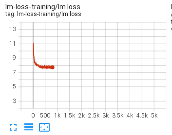
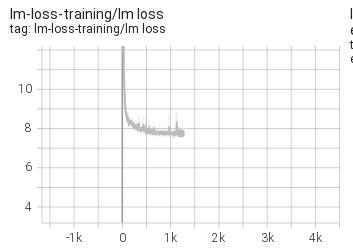
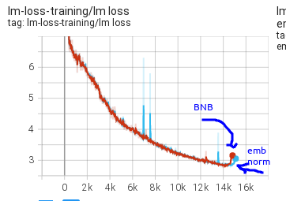
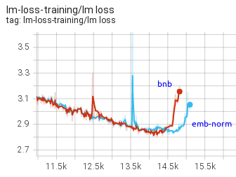
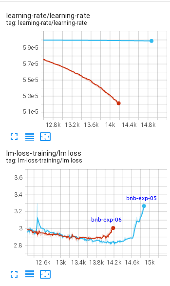
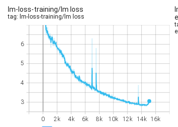
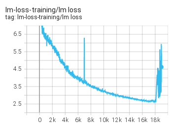
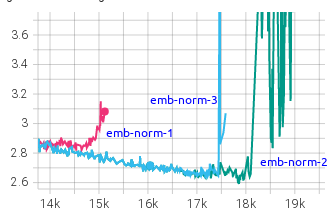
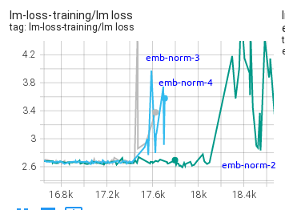

# Chronicles

Same as tr8-104B but using new additions such as:

1. Curriculum Learning (CL) https://arxiv.org/abs/2108.06084
2. BitsNBytes (BNB) https://github.com/facebookresearch/bitsandbytes

https://huggingface.co/bigscience/tr8b-104B-logs/tensorboard

## CL Experiment 1

Trying to figure out good baseline settings for CL

[baseline script](
https://github.com/bigscience-workshop/bigscience/blob/82fe642fb1eedd0361bac6899b79769e2c842c9f/train/tr8b-104B/tr8b-104B-cl.slurm)

Stopped training at iter 500:


## CL Experiment 2

finetuned exp 1 for more optimal performance

> Conglong Li

Here are my recommendation for next time: GPT-3 uses 375M token for LR warmup. Assuming the average seqlen is about 100 during LR warmup for CL (a very rough estimation), then we should set LR_WARMUP_SAMPLES= 375e6/100 = 3_750_000, this leads to 375e6/100/2048 = 1.8K warmup steps which sounds good to me

For peak LR, yeah 1e-4 might be a good next candidate, together with LR_WARMUP_SAMPLES=3_750_000

GPT-3 175B uses 6e-5 for batch size 1.6K, so 1e-4 for batch size 2K seems to be an appropriate/moderate increase.

Also change eval from every 1k to 150, since we can't tell from lm loss what's going on - we need the eval loss as it is reported for the full SEQLEN (whereas train lm loss just for the current CL SEQLEN instead).
150 since that's the current period between switching seqlen.

```
perl -pi -e 's|--lr 6e-5|--lr 1e-4|' *slurm
perl -pi -e 's|LR_WARMUP_SAMPLES=216_320|LR_WARMUP_SAMPLES=3_750_000|' *slurm
perl -pi -e 's|--eval-interval 1000|--eval-interval 150|' *slurm
```

[script](https://github.com/bigscience-workshop/bigscience/blob/d5fc4b22d7e88e87b4b9ec610b6c522b9a8c7a8d/train/tr8b-104B/tr8b-104B-cl.slurm)


## CL Experiment 3

Same as exp-2, but

```
    --lr 6e-5 \
    --embed-layernorm \
```

that is activating Embed LayerNorm that we found to be superior to all other experiments so far, and lowering `lr` to the same as the emb-norm experiments so that it's easier to compare the performance and quality.

```
perl -pi -e 's|--lr 1e-4|--lr 6e-5|' *cl*slurm
perl -pi -e 's|(--checkpoint-activations \\)|$1\n    --embed-layernorm \\|' *cl*slurm
```

[script](https://github.com/bigscience-workshop/bigscience/blob/5bc0d43cb782291b48c98cfba2d55ce0188f9961/train/tr8b-104B/tr8b-104B-cl.slurm)


## BNB Experiment 1

[script](https://github.com/bigscience-workshop/bigscience/blob/7a1481355a1abe097a9fb2c9021c292cb9971da3/train/tr8b-104B/tr8b-104B-bnb.slurm)



Tim:

what I have seen before with linear quantization, is that a smaller Adam eps is needed for stability. I never see this to be required for 8-bit Adam with dynamic quantization, but in the beginning of training the optimizer is a bit more unstable

For linear I found that stability started from `adam-eps=1e-6`

I think 1e-5 degraded performance quite a bit, so I would try 1e-6 and 1e-7

I am not sure how the initialization is done. It could be that the initial initialization for the embedding layer is overwritten and that may cause instabilities

I also see that you are using weight decay. I have not run many experiments with that and so unsure how the behavior is. For weight decay the AdamW formulation is used

When I tried 8-bit adam with fully sharded parallelism by just replacing the optimizer it did not work for me and I actually had a similar behavior as you see. Short decrease in loss and then stagnation. I think this could be related to the quantization statistics which are not properly synchronized across shards. But this is just a hunch. I think this could be tested by running a small model (maybe something like 500M params) and see if 8-bit Adam works there. If it does not work, it might be related to the quantization statistics

So with xavier the max value for the embedding layer is 0.0106 and the 99% percentile value for N(0, 0.006) is 0.18 which is much larger. So it could just be the initialization

I think 0.006 is still very high for the embedding layer. So that might be the issue, but could also the other things mentioned. I would leave the init value for the other layers if that worked for you

Stas:

I will add an experiment to leave the default init for the embed layer, and keep our 0.006 for the rest.

## BNB Experiment 2

So trying lower Adam eps:

```
--adam-eps 1e-6 \
```

```
perl -pi -e 's|--adam-eps 1e-8|--adam-eps 1e-6|' *bnb*.slurm
```

this made no difference, got an identical loss as exp 1


## BNB Experiment 3

Rollback to Exp 01, restore `--adam-eps`

```
perl -pi -e 's|--adam-eps 1e-6|--adam-eps 1e-8|' *bnb*.slurm
```

Try to turn optimizer sharding off - turn off ZeRO-1 - perhaps it doesn't work well with the 8-bit optimizer.

```
perl -pi -e 's|ZERO_STAGE=1|ZERO_STAGE=0|' *bnb*.slurm
```

Not sure if the setup won't OOM now. Got 31.7GB memory - it's borderline OOM.

no change, same trajectory

ZeRO-1's optim state sharding should be totally transparent, since it unshards the states before the optimizer gets to see them. But it was good to validate that in an experiment.

## BNB Experiment 4

Rollback to Exp 01,

Let's do a quick test with `--init-method-std 0.02` - we know it's not good for most of the model, but let's see if it impacts for the better the really early issue with BNB. If it does make things better then we can do the different init for different layers, so changing:

```
perl -pi -e 's|--init-method-std 0.006|--init-method-std 0.02|' *bnb*.slurm
```

Something is wrong there, as it very quickly stopped improving and got stuck at loss 8




## BNB Experiment 5

Discovered `StableEmbedding` wasn't integrated correctly in the original BNB PR, as it wasn't doing the right thing for split word embedding under TP>1, so fixing it in [PR182](https://github.com/bigscience-workshop/Megatron-DeepSpeed/pull/182).

Rollback to Exp 01, no config change this time around.


We did emb-norm and bnb experiments (BNB Exp 5) in parallel and both tracked the same lm loss trajectory, here is the combination:



BNB started diverging just before. So we can tell BNB is more susceptible to instabilities.

Here is a zoomed in version:




## BNB Experiment 6

Tim suggested that dropping to a lower LR faster and having the min-lr lower helped a lot in his experiments, so let's try that:


```
 iteration     6502/  159576 | consumed samples:       216960 | consumed tokens:    444334080 | elapsed time per iteration (ms): 31074.1 | learning rate: 5.997E-05 | global batch size:    80 | lm loss: 3.876781E+00 | loss scale: 4096.0 | grad norm: 3246.595 | num zeros: 0.0 | number of skipped iterations:   0 | number of nan iterations:   0 |
 iteration     6503/  159576 | consumed samples:       217040 | consumed tokens:    444497920 | elapsed time per iteration (ms): 31065.8 | learning rate: 6.000E-05 | global batch size:    80 | lm loss: 4.023108E+00 | loss scale: 4096.0 | grad norm: 3670.127 | num zeros: 0.0 | number of skipped iterations:   0 | number of nan iterations:   0 |
 iteration     6504/  159576 | consumed samples:       217120 | consumed tokens:    444661760 | elapsed time per iteration (ms): 31073.4 | learning rate: 6.000E-05 | global batch size:    80 | lm loss: 4.030526E+00 | loss scale: 4096.0 | grad norm: 2954.856 | num zeros: 0.0 | number of skipped iterations:   0 | number of nan iterations:   0 |

 ...


  iteration     8600/  159576 | consumed samples:       464560 | consumed tokens:    951418880 | elapsed time per iteration (ms): 66451.1 | learning rate: 6.000E-05 | global batch size:   160 | lm loss: 3.407058E+00 | loss scale: 8192.0 | grad norm: 3035.816 | num zeros: 0.0 | number of skipped iterations:   0 | number of nan iterations:   0 |
  # the log seems to still report 6.000E-05 for a while but TB starts decaying already here - probably a rounding to 3 points issue 6564 is the last one of 6e-5 on TB
```

but I don't have those older checkpoints, the only one I have is `global_step6000` so will use it.

will try: 1% from lr: `--min_lr 6e-7` so it should decay 10x faster.

And reducing `--lr-decay-samples` from `126_953_125` to `12_695_312`

But one can't change the lr config once the training started, so getting:

```
AssertionError: AnnealingLR: class input value 1e-06 and checkpointvalue 1e-05 for minimum learning rate do not match
```

But discovered a new option which seems to allow an override:

```
    --override-lr-scheduler \
```

So going to change the plan and switch to a recent `global_step12000` checkpoint instead, some time before the divergence:

```
 iteration    12000/  159576 | consumed samples:      1519744 | consumed tokens:   3112435712 | elapsed time per iteration (ms): 207967.5 | learning rate: 5.999E-05 | global batch size:   528 | lm loss: 2.985657E+00 | loss scale: 262144.0 | grad norm: 79683.827 | num zeros: 0.0 | number of skipped iterations:   0 | number of nan iterations:   0 |
```

so the next step with:

```
    --min-lr 6e-7 \
    --lr-decay-samples 12_695_312 \
    --override-lr-scheduler \
```

dropped the learning rate to `5.842E-05` from `5.999E-05`

```
 iteration    12001/  159576 | consumed samples:      1520272 | consumed tokens:   3113517056 | elapsed time per iteration (ms): 279206.6 | learning rate: 5.842E-05 | global batch size:   528 | lm loss: 3.029124E+00 | loss scale: 262144.0 | grad norm: 60983.653 | num zeros: 0.0 | number of skipped iterations:   0 | number of nan iterations:   0 |
```

so let's see if that makes a difference.


Clearly LR didn't get low fast enough and it diverged too, but even sooner than bnb-exp-5!




## Embed-Norm Experiment 1


Since we discovered BNB did so well, we decided to try just adding Embedding LayerNorm to the normal training. So did an experiment that is the same as Exp12 but with `--embed-layernorm` enabled.

[tr8b-104B-emb-norm-64n.slurm](/.tr8b-104B-emb-norm-64n.slurm)


It worked really well till 14k and then diverged




## Embed-Norm Experiment 2

Let's try to first restart with some data skipping to see if data was the issue:

1. Rollback to 13250 and skip data till 14k:

```
 iteration    13251/  159576 | consumed samples:      2333840 | consumed tokens:   4779704320 | elapsed time per iteration (ms): 220631.9 | learning rate:
 5.996E-05 | global batch size:   800 | lm loss: 2.924229E+00 | loss scale: 524288.0 | grad norm: 122160.116 | num zeros: 0.0 | number of skipped iteratio
ns:   0 | number of nan iterations:   0 |
...
 iteration    14000/  159576 | consumed samples:      3014320 | consumed tokens:   6173327360 | elapsed time per iteration (ms): 255453.3 | learning rate: 5.994E-05 | global batch size:  1024 | lm loss: 2.898812E+00 | loss scale: 4096.0 | grad norm: 2553.971 | num zeros: 0.0 | number of skipped iterations:   0 | number of nan iterations:   0 |
```

so will repeat Exp 1 with `--skip-train-iteration-range 13251-14000`

Worked well for a while and then started flatting out around 17k and then went on a roller coaster around 18k.




## Embed-Norm Experiment 3

Repeat the same as last time

1. Rollback to 16651 and skip data till 18500:

so will repeat Exp 2 with `--skip-train-iteration-range 13251-14000 16652-18500`

Actually got the same problem as exp 2 but arriving even sooner:





## Embed-Norm Experiment 4

Repeat the same as last time but let's try another data range. Seeing how the rollercoaster started around 18k, let's go for 19500.

1. Rollback to 16651 and skip data till 19500:

so will repeat Exp 2 with `--skip-train-iteration-range 13251-14000 16651-19500`

It didn't help. It exhibited the same behavior as Exp 2 and 3.



Next, will try to reset the optimizer.


## Embed-Norm Experiment 5

So 2 data skipping attempts didn't help. Let's try resetting the optimizer states next.

Half-way optimizer reset method:

- reset optimizer - don't load the previous states from the checkpoint with the help of `--no-load-optim`
- since we can't do lr warm up half-way through the training we will cheat and simply run the optimizer w/o updates to the weights by setting `lr=0` - now let it train for this number of iterations to emulate warm up (1/(1-0.95)) * 5 = 100 (beta2 = 0.95)
- XXX: counters for bias correction have to be reset ???
- then resume normal training, after restoring the setup to normal

1. Rollback to 16800 (last stable low loss point)
2. Calculate how to get the framework to run for 100 extra iterations and stop
```

 iteration    16800/  159576 | consumed samples:      7594208 | consumed tokens:  15552937984 | elapsed time per iteration (ms): 384505.8 | learning rate: 5.955E-05 | global batch size:  2048 | lm loss: 2.682074E+00 | loss scale: 524288.0 | grad norm: 180376.315 | num zeros: 0.0 | number of skipped iterations:   0 | number of nan iterations:   0 | samples per second: 0.005 | TFLOPs: 35.24 |
 iteration    16801/  159576 | consumed samples:      7596256 | consumed tokens:  15557132288 | elapsed time per iteration (ms): 400291.6 | learning rate: 5.955E-05 | global batch size:  2048 | lm loss: 2.657616E+00 | loss scale: 524288.0 | grad norm: 226760.401 | num zeros: 0.0 | number of skipped iterations:   0 | number of nan iterations:   0 | samples per second: 0.005 | TFLOPs: 33.85 |
```


so each iteration is 2048 samples at this point and thus we want to run for an additional 204800 samples, and thus we know we want to stop at 7799008 (7594208+204800) 7594208 was consumed samples at iteration 16800. i.e. the new setting is `--train-samples 7799008`

For the optimizer reset run we need to add:
```
    --no-load-optim \
    --override-lr-scheduler \
```
and change:
```
    --lr 0 \
    --min-lr 0 \
    --train-samples 7799008 \
```

Automating the change:
```
perl -pi -e 's|(--checkpoint-activations \\)|$1\n    --no-load-optim \\|' tr8b-104B-emb-norm-64n.slurm
perl -pi -e 's|(--checkpoint-activations \\)|$1\n    --override-lr-scheduler \\|' tr8b-104B-emb-norm-64n.slurm
perl -pi -e 's|--lr 6e-5|--lr 0|' tr8b-104B-emb-norm-64n.slurm
perl -pi -e 's|--min-lr 6e-6|--min-lr 0|' tr8b-104B-emb-norm-64n.slurm
perl -pi -e 's|--train-samples 300_000_000|--train-samples 7799008|' tr8b-104B-emb-norm-64n.slurm
```

1. Now run this job once
2. and the next job restore the slurm script to the original as the optimizer should have been warmed up

once (1) started running, back it up and restore the original:
```
cp tr8b-104B-emb-norm-64n.slurm tr8b-104B-emb-norm-64n.slurm.reset-optim
git checkout tr8b-104B-emb-norm-64n.slurm
```
but the checkpoint will now have wrong lr info, so we again need to tell megatron to ignore it and use the normal lr setup:

```
perl -pi -e 's|(--checkpoint-activations \\)|$1\n    --override-lr-scheduler \\|' tr8b-104B-emb-norm-64n.slurm
```

once (2) has started running and all looks good we can then reset it to remove `--override-lr-scheduler`


(ideally we should reset to the 16800 checkpoint in `last` for after optim warm up is over, but then we don't have a way to get the new optim state)
